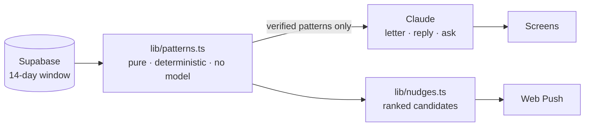

# Grove

A reflection app for body, mind, and direction — read by a model that is only allowed to say what is true.

Grove is built against two rules that outrank every feature in it:

1. **No scores, no streaks, no grades, no comparison** — not even against your own past.
2. **Nothing is asserted that separate, deterministic code hasn't verified first.**

Grove is allowed to be quiet. It is not allowed to be motivating and wrong.

**Stack:** Next.js 16 (App Router, React 19) · TypeScript · Tailwind v4 · Supabase (Postgres, RLS, magic-link auth) · Anthropic Claude · Web Push · Google Health

> The full design reasoning — why each of these decisions is the way it is, and what broke when it wasn't — lives in **[CLAUDE.md](CLAUDE.md)**.

---

## The shape of the app

| | |
|---|---|
| **`/home`** | The letter, the intentions it asked for, the invitation to capture, the compact grove, the body, the vectors |
| **`/grove`** | The whole record: the tree, Ask Grove, the letters archive by week |
| **`/rhythm`** | Fourteen days of body + mind as data, plus the verified patterns |
| **`/you`** | Appearance, notifications, band, account |
| **Capture** | A *sheet*, not a route — opened from the tab bar's center button |
| **`/welcome`** | Four-question cold start, so day one has something in it |

## How the honesty rule is actually enforced

The interesting constraint isn't the prompt — it's that the model never gets to do the reasoning.



`lib/patterns.ts` decides what is true. The model is handed only those verified patterns plus a factual window summary, and is forbidden from referencing anything else. Same for `lib/nudges.ts`, which is the same kind of code — pure, deterministic, no model, no clock read, no database.

Two consequences worth calling out:

- **"Your record can't answer that yet" is a feature, not a failure path.** Ask Grove will refuse rather than invent a correlation. Most of that system prompt's length exists to defend the refusal — it's the exact surface where a model most wants to be helpful and make something up.
- **Raw dial numbers never enter a prompt.** An earlier version emitted `mood 4/5, energy 3/5` into the context, and the model dutifully echoed "focus 4/5" back at a user — the product's loudest promise broken by its own context string. The dials go in as words. A number the model is never given is a number it can never echo.

## The tree

`lib/grove-tree.ts` + `components/tree.tsx` — the only view of the *whole* record; everything else is a 14-day window.

The brief was "track but not measure," which is harder than it sounds: a tree that fills up as you show up is a streak wearing bark. Three properties resolve it:

- **The skeleton is time, not effort.** Trunk and branches grow from weeks elapsed — so the tree grows on the weeks you never open the app. There is no state in which it shrinks or wilts.
- **A leaf is a day you set something down; its lift is how that day *felt*** — not how well it went. A heavy day is on the tree, sitting lower. A hard month is visible as texture, never as absence.
- **No total.** No count, no percentage, no fullness. Because leaf position carries felt state rather than merit, there's no scalar to extract and rank.

## The model layer

Three jobs, three tiers, one file (`lib/model.ts` — nothing else in the app names a model). Roughly **$1.05/user/month, down from ~$2.75**.

| | Model | Why |
|---|---|---|
| **The letter** (`lib/brief.ts`) | Opus 5, adaptive thinking, structured outputs, cache-marked system prompt | Quality matters more than latency; briefs cluster in the morning, so at scale most read the cached prefix |
| **The reply** (`app/api/reply/route.ts`) | Haiku 4.5, streamed | Latency *is* the feature here — 1.6s to first token vs 2.5s, at ~$0.0002/call. `patterns.ts` already did the reasoning |
| **Ask Grove** (`app/api/ask/route.ts`) | Opus 5, adaptive, streamed | Deciding what a record does and doesn't license is exactly where a cheaper model starts being agreeable instead of correct |

The largest saving wasn't the tiering — it was **quantizing volatile facts out of the brief's content signature**. Step counts drift all day as the band syncs; every drift changed the signature and bought a fresh Opus letter. Steps now round to the nearest 1000, which is also the more truthful register for a letter forbidden to treat a step count as a target.

## Data visualization

`components/rhythm-chart.tsx` — small multiples, one series per facet, column-aligned on a shared time axis so body→mind coupling is *seen*, not asserted.

- **Never lines.** A line interpolates across a day with no check-in and invents a value.
- **Two marks, because there are two kinds of data.** Sleep is a magnitude → a bar from true zero with a dashed reference at your usual night. The dials are ordinal positions on a scale of words → a mark on a track. A bar there claimed "bright" is five times "heavy."
- **Every direct label carries its age.** A mood set down ten days ago used to read as present tense — the chart stating something false while the rest of the app was built to make that impossible.

Chart hues are deliberately *not* the brand greens: run through a categorical-contrast validator, moss sits at chroma 0.049 against a 0.10 floor, and dark-mode moss-vs-ember lands at ΔE 5.3 under protanopia against a floor of 6.

## Other things worth a look

- **Auth is a local verification, not a round-trip.** `getClaims()` verifies the ES256 JWT locally via WebCrypto — the signing keys are asymmetric. The previous `auth.getUser()` was called three times per navigation and was most of the time-to-first-byte. RLS remains the real boundary.
- **The floor and the ceiling.** `lib/read.ts` computes an honest headline deterministically in microseconds and renders as the Suspense *fallback*; the model letter streams in on top. An LLM call never sits on the render path of a first paint.
- **The schedule is not the trigger.** Every nudge gate — weekly cap, cooldown, minimum gap, civil-hours — lives in `lib/nudges.ts`, so the cron route is safe to run hourly, daily, or twice by accident and behaves identically. A promise that depends on a crontab entry is a configuration, not a promise.
- **`public/sw.js` has no `fetch` handler on purpose.** Screens are Server Components rendered from a live window; a cached shell would serve yesterday's letter as though it were today's.

## Running locally

```bash
git clone https://github.com/dylanj7/grove.git
cd grove
npm install
cp .env.example .env.local   # then fill in your keys
npm run dev
```

```
ANTHROPIC_API_KEY=                        # server-side
NEXT_PUBLIC_SUPABASE_URL=
NEXT_PUBLIC_SUPABASE_PUBLISHABLE_KEY=
SUPABASE_SECRET_KEY=                      # server-side
CRON_SECRET=                              # nudge route returns 401 to everyone when unset
VAPID_PUBLIC_KEY=                         # Web Push; npx web-push generate-vapid-keys
VAPID_PRIVATE_KEY=
VAPID_SUBJECT=
GOOGLE_HEALTH_CLIENT_ID=                  # optional — wearable sync
GOOGLE_HEALTH_CLIENT_SECRET=
GOOGLE_HEALTH_REDIRECT_URI=
```

Apply `scripts/phase*.sql` in filename order in the Supabase SQL editor — each is additive and idempotent. Deploys to Vercel; `vercel.json` runs the nudge cron daily at 16:00 UTC (see [`scripts/nudges-cron.md`](scripts/nudges-cron.md) for which timezones that costs).

## Known gaps

- **The repo does not contain a from-scratch schema.** `scripts/phase*.sql` starts at phase 4 and is additive — it alters and extends tables that phases 1–3 created in the live database. `briefs`, `checkins`, `goals`, `goal_touches`, and `physical_days` are queried by the code but created by no script here, so a fresh clone can't stand the database up without writing those definitions first.
- **Google Health scopes are Restricted.** They need Google's privacy/security review before a public launch; for now the developer connects as a registered test user on the OAuth consent screen. The API is also pre-GA, so scope identifiers and response shapes may still shift — `lib/health-google.ts` isolates every Google-specific detail behind a provider-neutral seam for that reason.
- **Mobile-first by intent.** From `md` up the column is framed and the tab bar pinned, so a desktop share doesn't look like a phone app stretched across a 27-inch display — but the design target is a phone.
